# jaydev Portfolio

Personal portfolio website — **Next.js 16 (App Router) + Supabase + Tailwind CSS v4**, dengan admin dashboard untuk mengelola seluruh konten.

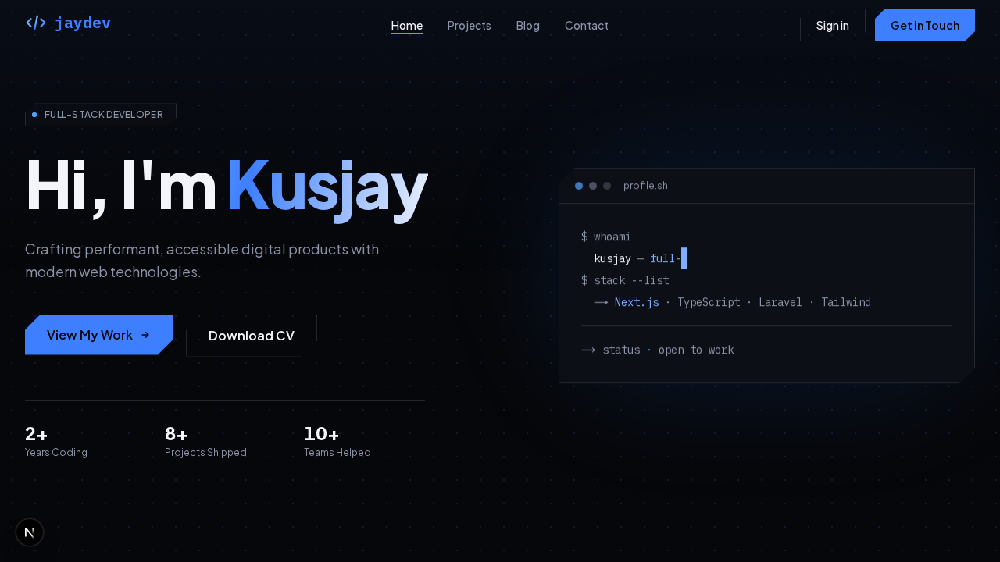

---

## ✨ Fitur

### Publik
- **Homepage** — hero dengan efek typewriter & gradient sweep, statistik ringkas, tech-stack marquee, section About, carousel project & blog terbaru (drag/scroll + tombol navigasi), dan CTA kontak.
- **Projects** — daftar semua project yang *published*, filter-ready, card dengan hover effect.
- **Detail project/post** — konten dirender dari rich-text editor (Tiptap) → HTML tersanitasi (DOMPurify), dukungan embed YouTube/Vimeo, gambar featured rasio 16:9.
- **Blog** — listing post dengan kategori, tags, dan estimasi waktu baca (auto-hitung dari konten).
- **Contact** — form pesan yang langsung masuk ke inbox admin (tabel `messages`), plus social links.

### Admin (butuh login)
- **Auth** — login email+password via Supabase Auth di `/login`, guard route otomatis lewat `proxy.ts` (semua `/admin/*` dilempar ke `/login` bila belum login), tombol navbar berubah **Sign in ⇄ Dashboard** sesuai sesi.
- **Dashboard** — statistik (jumlah project, post, pesan) + 5 pesan terbaru yang bisa diklik menuju inbox.
- **CRUD Projects & Blog** — form lengkap: rich text editor WYSIWYG (bold/italic/heading/list/align/quote/code), upload gambar drag-and-drop ke Supabase Storage (bucket `images`, validasi tipe & ukuran, auto kebab-case filename), status draft/published/archived, toggle "Show on Homepage".
- **Messages** — tabel inbox: klik baris membuka modal isi pesan penuh, auto mark-as-read, tombol read/unread & delete per baris.

---

## 📄 Halaman

| Route | Deskripsi | Screenshot |
|---|---|---|
| `/` | Homepage: hero, stats, marquee, about, project & blog carousel, CTA |  |
| `/projects` | Grid semua project published | 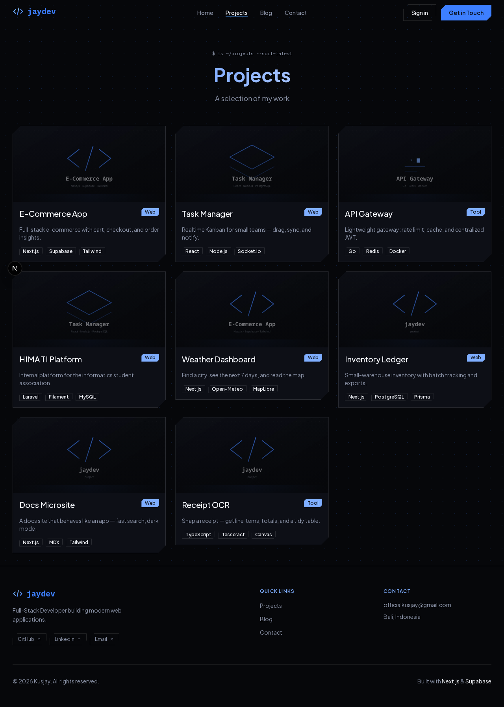 |
| `/projects/[slug]` | Detail project: badge tech, gambar 16:9, konten HTML | 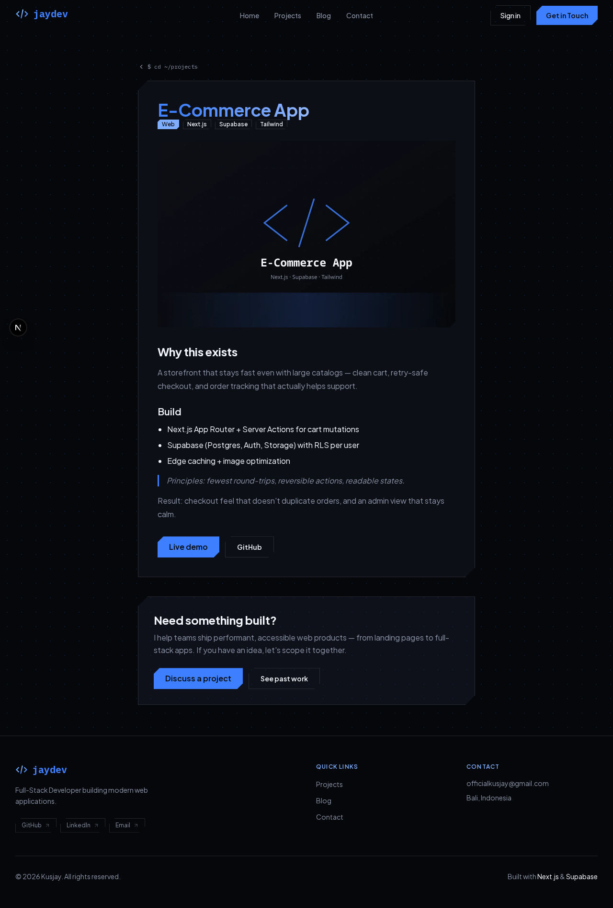 |
| `/blog` | Daftar post (kategori, read time) | 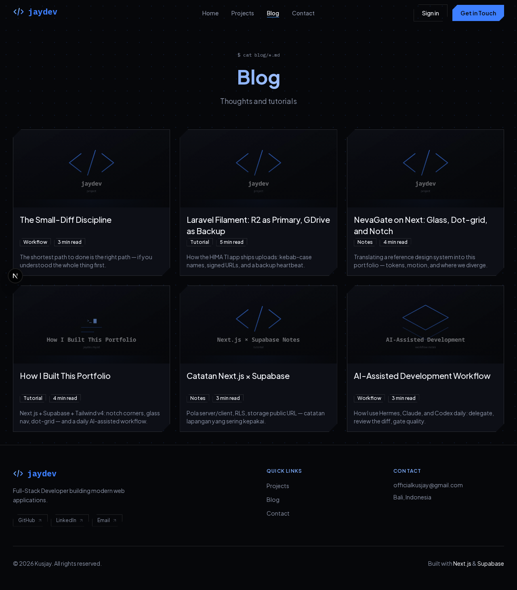 |
| `/blog/[slug]` | Detail artikel lengkap | 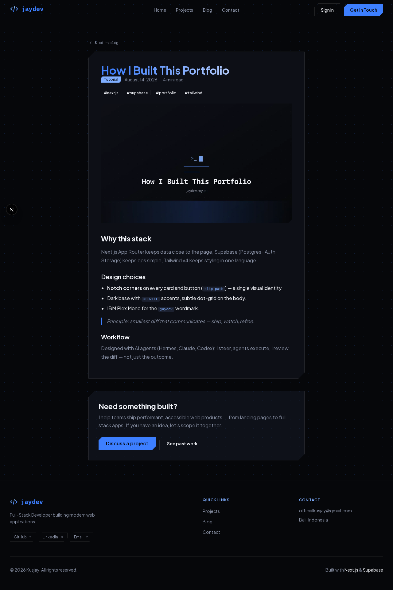 |
| `/contact` | Form pesan → masuk admin inbox | 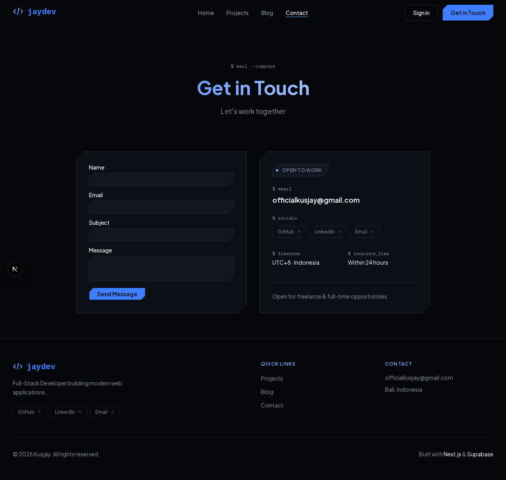 |
| `/login` | Login admin (tanpa navbar/footer) | 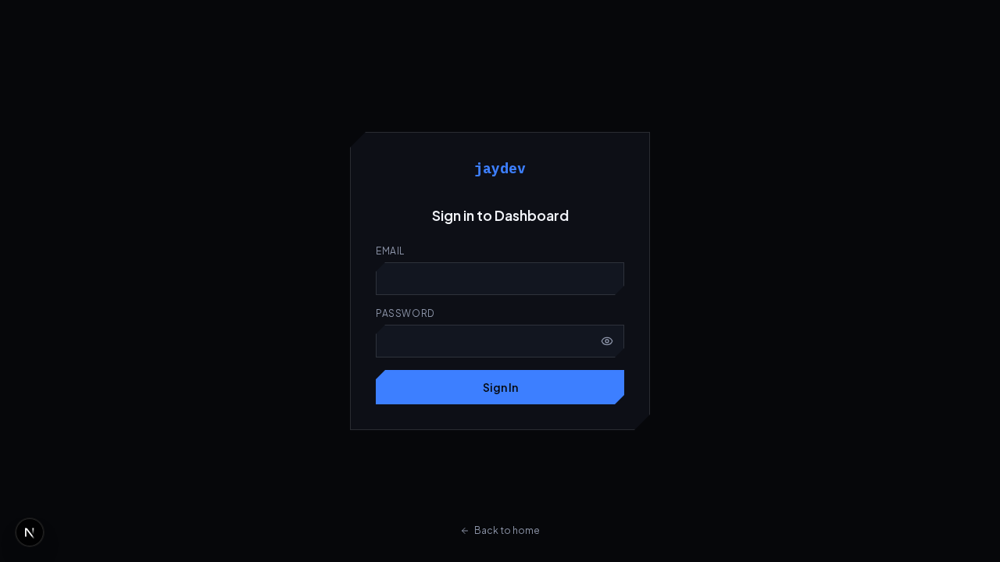 |
| `/admin` | Dashboard: stats + recent messages | 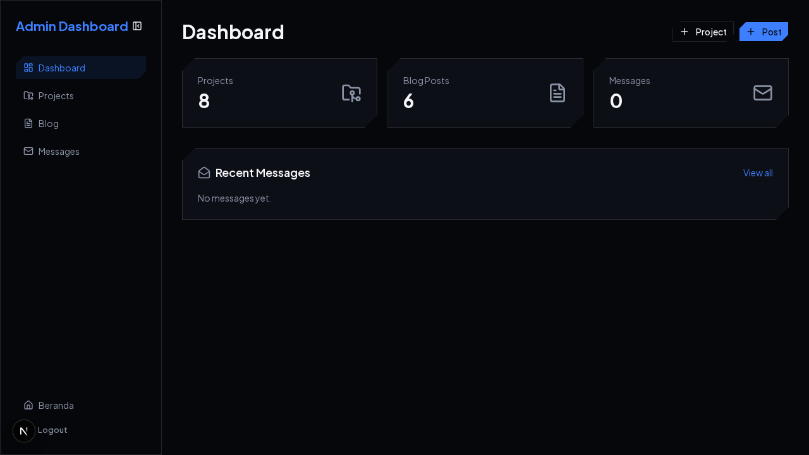 |
| `/admin/projects` | List projects admin + badge Shown/Hidden | 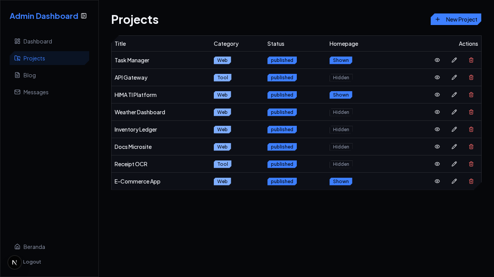 |
| `/admin/blog` | List blog admin | 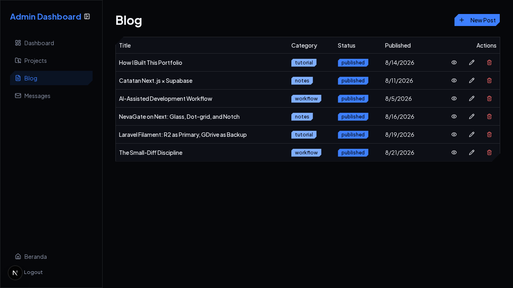 |
| `/admin/messages` | Inbox dengan modal detail | 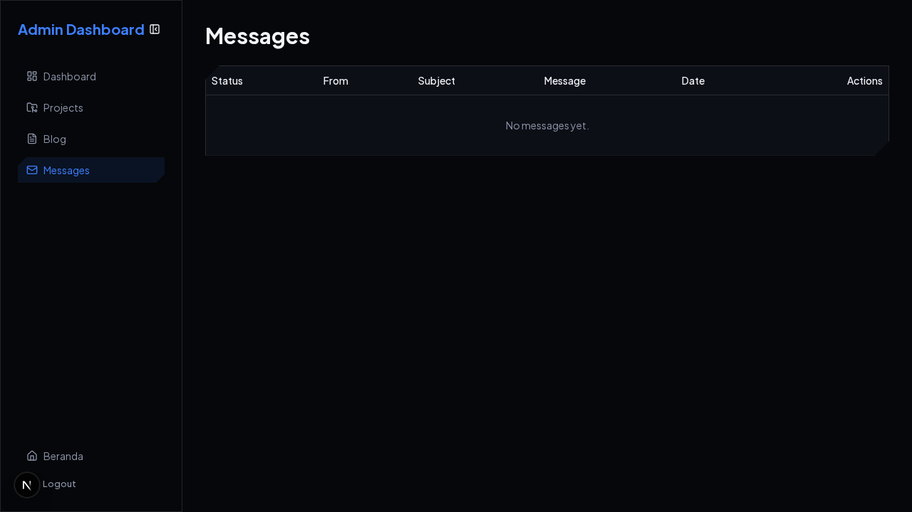 |

---

## 🛠 Tech Stack

| Layer | Teknologi |
|---|---|
| Framework | Next.js 16 (App Router, Turbopack, React 19) |
| Styling | Tailwind CSS v4 (`@tailwindcss/postcss`), komponen shadcn-style di `components/ui/`, ikon lucide-react |
| Animasi | framer-motion (hero, reveal-on-scroll, hover lift), CSS keyframes custom (marquee, text sweep, notch clip-path) |
| Database | Supabase (PostgreSQL 15) dengan Row Level Security |
| Auth | Supabase Auth (@supabase/ssr) — session cookie httpOnly, guard via `proxy.ts` |
| Storage | Supabase Storage (bucket publik `images`) |
| Rich text | Tiptap 3 (+ StarterKit, TextAlign) |
| Markdown/HTML sanitizer | marked + isomorphic-dompurify |

---

## 🗄️ ERD — Database Schema

> 6 tabel standalone (tanpa foreign key antar tabel) + 1 bucket Storage `images`. Detail kolom & RLS: [docs/DATABASE.md](docs/DATABASE.md).

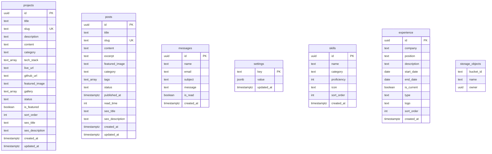

*Catatan:* `projects`/`posts` visibility dikontrol `status = 'published'`; `messages` `FOR INSERT` terbuka untuk form Contact, sisanya `authenticated` only via RLS Supabase. Bucket Storage `images` dipakai untuk upload foto project/post.

---

## 🚀 Setup dari nol (buat yang baru clone)

### 1. Install dependencies

```bash
npm install
```

> Butuh Node.js 20+. Kalau shell-mu `NODE_ENV=production`, jalankan `npm install --include=dev` agar devDependencies ikut terpasang.

### 2. Setup database Supabase

1. Buat project di [supabase.com](https://supabase.com)
2. **SQL Editor** → jalankan migrasi:
   - `supabase/migrations/00001_initial_schema.sql` — tabel, index, RLS, storage bucket `images`
3. Masih di SQL Editor → jalankan `supabase/seed.sql` — data awal (project + post contoh)

> Gambar placeholder sudah ada di repo (`public/images/`), jadi seed langsung tampil. Regenerasi: `node scripts/generate-placeholders.js`

Skema lengkap: [docs/DATABASE.md](docs/DATABASE.md).

### 3. Konfigurasi environment

```bash
cp .env.local.example .env.local
```

Isi dari Supabase Dashboard → Project Settings → API:

```
NEXT_PUBLIC_SUPABASE_URL=https://<ref>.supabase.co
NEXT_PUBLIC_SUPABASE_ANON_KEY=<anon-key>
NEXT_PUBLIC_SITE_URL=http://localhost:3000
```

### 4. Buat akun admin

Dashboard Supabase → **Authentication** → **Users** → *Add user* (email + password, auto-confirm). Login di `/login`.

### 5. Jalankan

```bash
npm run dev     # http://localhost:3000
npm run build   # production build
npm run lint
```

---

## 📁 Struktur Proyek (3 tingkat)

```text
portfolio/
├── app/                          # Pages (flat, tanpa (public))
│   ├── page.tsx + layout.tsx + globals.css
│   ├── projects/ → page.tsx, [slug]/page.tsx
│   ├── blog/ → page.tsx, [slug]/page.tsx
│   ├── contact/ → page.tsx
│   ├── login/ → page.tsx (tanpa PublicShell)
│   ├── admin/ → layout.tsx, projects/, blog/, messages/
│   └── api/ → contact/route.ts, messages/read/route.ts
├── components/
│   ├── layout/ → Navbar, Footer, PublicShell, PageHeader
│   ├── sections/ → Hero, About, TechMarquee, Projects, Blog, Contact
│   ├── projects/ + blog/ + contact/ → Card & Grid
│   ├── admin/ → RichTextEditor, ImageUpload, MessagesTable
│   └── ui/ → badge, button, card, input, table, LogoIcon
├── lib/
│   ├── supabase/ → client.ts, server.ts, queries.ts
│   └── markdown.ts, utils.ts
├── public/                       # Gambar (bukan pages!)
│   ├── images/projects/, images/posts/
│   └── logo-jaydev.svg, resume.pdf
├── supabase/ → migrations/00001_initial_schema.sql, seed.sql
├── scripts/ → seed.sql, fresh-seed.sql, generate-placeholders.js
├── docs/ → DATABASE, API, DEPLOYMENT, PROJECT_STRUCTURE, screenshots/
└── proxy.ts                      # Guard: /admin/* → /login
```

> `app/` = pages/routes, `public/` = gambar (jangan tertukar).
> Detail per file: [docs/PROJECT_STRUCTURE.md](docs/PROJECT_STRUCTURE.md).

## 🔧 Scripts tambahan

| Perintah | Fungsi |
|---|---|
| `node scripts/generate-placeholders.js` | Regenerate placeholder images bertema situs |
| `scripts/seed.sql` | Seed tambahan idempotent (aman untuk DB berisi) |
| `scripts/fresh-seed.sql` | Reset data: TRUNCATE projects/posts lalu isi ulang |

## 📦 Deploy

Panduan lengkap (Vercel + env production): [docs/DEPLOYMENT.md](docs/DEPLOYMENT.md).

---

*Last updated: Agustus 2026*
